# Claude C-Suite Plugin


あらゆるコードベースに経営チームの視点を。13の専門レビューコマンドと、最適なCxOへ自動振り分けするルーター（`/ask`）が、異なるリーダーシップの観点からプロジェクトを分析します。

> 📝 **紹介記事**: [Claude Codeに「経営会議」を持ち込む — claude-c-suite-plugin を作った話 (Qiita)](https://qiita.com/kiyotaman/items/29718a0d5f6363ccb8a2)

## 60秒クイックスタート

```bash
/plugin marketplace add JFK/claude-c-suite-plugin
/plugin install claude-c-suite
```

任意の git リポジトリで：

```
/claude-c-suite:ceo
```

CEO コマンドが自動的にプロジェクトを診断し、最も関連の深い3つの経営視点を選び、優先順位付きのアクションリストを返します。**迷ったら `/ceo` から始めてください** — 常に正しい安全な入り口として設計されています。

詳細な使い方ガイド（決定木、よく使うパターン、複数ロール相談、プラグイン併用、トラブルシューティング）は **[USAGE.ja.md](./USAGE.ja.md)** ([English](./USAGE.md)) を参照してください。

## コマンド一覧

| コマンド | 役職 | レビュ対象 |
|----------|------|-------------|
| `/ceo` | CEO（メタレイヤー） | ニーズに対して最適な3つのCxOを選定し、統合的な経営判断を下す |
| `/ask` | C-Suiteルーター | 質問を最適な1つのCxOに自動振り分けし、その単一視点で回答 |
| `/cto` | 高技術責任者 | 技術的負債、アーキテクチャ、リファクタリング優先度、依存関係リスク |
| `/pm` | プロダクトマネージャー | マイルストーン整理、Issue優先順位、リリース計画 |
| `/cdo` | 最高デザイン責任者 | UI/UX一貫性、デザインシステム、コンポーネント再利用 |
| `/cso` | 最高セキュリティ責任者 | 脆弱性、認証パターン、シークレット管理、OWASP Top 10 |
| `/clo` | 最高法務責任者 | ライセンス準拠、データプライバシー、規制対応、知的財産保護 |
| `/coo` | 最高執行責任者 | CI/CDパイプライン、デプロイ戦略、可観測性、障害対応体制 |
| `/cmo` | 最高マーケティング責任者 | SEO、Core Web Vitals、SNSシェア、アナリティクス実装 |
| `/caio` | 最高AI責任者 | AI/MLガバナンス、モデルライフサイクル、責任あるAI、LLM統合 |
| `/cfo` | 最高財務責任者 | クラウドコスト最適化、リソース効率、課金ロジック、計算資源の無駄 |
| `/cio` | 最高情報責任者 | データガバナンス、システム統合、情報アーキテクチャ、スキーマ管理 |
| `/qa-lead` | QAリード | テストカバレッジ、品質メトリクス、テスト戦略の穴 |
| `/dx-lead` | DXリード | 開発者体験、API人間工学、SDKユーザビリティ、オンボーディング |

## 各ロールの詳細

### CEO（メタレイヤー）とルーター

- **CEO** — 相関図の上に立つメタレイヤー。ユーザーのニーズを分析し、11ロールから最も適切な3つのCxO視点を選定。それぞれの観点で分析した上で、合意点・対立点・トレードオフを統合して経営判断を導出する。専門知識ではなく**どの専門家に聞くべきか**を判断する。*"The right 3 perspectives beat all 11 spread thin（適切な3つの視点は、11全部を薄く見るより強い）"*
- **`/ask`（ルーター）** — `/ceo` の軽量版。1つの質問を**最適な1名**のCxO/Leadに自動振り分けし、その単一視点で回答する。「質問はあるが誰に聞けばいいか分からない」ときに使う。`/ceo`より安く（1視点 vs 3視点）、各ロール直接呼び出しより簡単（組織図を覚えなくてよい）。質問が本当に複数視点の統合を必要とする場合は、ルーティングを辞退して`/ceo`にリダイレクトする。*"One sharp lens beats three blurry ones（鋭い1視点はぼんやり3視点に勝る）"*

### 戦略・経営

- **CTO** — コードベースの健全性を守る。時間とともに複利で膨らむ技術的負債を特定し、アーキテクチャ判断を評価し、リファクタリングの優先度を決める。*"Debt compounds（負債は複利で膨らむ）"*
- **PM** — リリースへの舵取り。マイルストーンを整理し、Issueをインパクト順に並べ、機能追加よりバグ修正を優先する。*"Bugs before features（バグ修正が先）"*
- **CFO** — 無駄を追い詰める。N+1クエリ、遊休リソース、キャッシュの欠如を発見し、課金ロジックの正確性を監査する。*"Every query has a price tag（全クエリにコストがある）"*
- **CIO** — 情報アーキテクチャを統治する。データモデル、スキーマ健全性、マイグレーション安全性、システム統合契約、データライフサイクルをレビューする。*"Schema is the contract between past and future（スキーマは過去と未来の契約）"*

### セキュリティ・法務

- **CSO** — 攻撃者の視点で考える。認証フローを監査し、ハードコードされたシークレットをスキャンし、OWASP Top 10に照らして依存関係を検査する。*"Secrets are toxic（シークレットは毒物）"*
- **CLO** — 法的リスクを排除する。依存関係のライセンスツリーをマッピングしてコピーレフトの衝突を検出し、GDPR/CCPA対応を評価し、IP出所を検証する。*"Licenses are viral（ライセンスは伝染する）"*

### プロダクト・デザイン

- **CDO** — デザインの一貫性を強制する。コンポーネントの再利用、デザイントークンの遵守、アプリ全体のUX整合性をレビューする。*"Components are contracts（コンポーネントは契約）"*
- **CMO** — プロダクトを発見可能にする。SEOの基本、Core Web Vitals、OGP/SNSシェア、アナリティクスの実装状況を検査する。*"Speed is conversion（速度はコンバージョン）"*

### 運用・AI

- **COO** — 本番環境を安定稼働させる。CI/CDパイプライン、デプロイ戦略、可観測性のカバレッジ、障害対応体制を監査する。*"Deploys should be boring（デプロイは退屈であるべき）"*
- **CAIO** — AIを責任ある形で統治する。モデルライフサイクル、プロンプトエンジニアリング品質、バイアス検出、評価基盤、ガードレールをレビューする。*"Prompts are production code（プロンプトは本番コード）"*

### リード（CxO配下）

- **QA Lead** — テストの穴を塞ぐ。カバレッジを測定し、不足するテストシナリオを特定し、テスト戦略を全体的に評価する。*"Every bug is a missing test（バグはテストの欠落）"*
- **DX Lead** — 開発者の幸福を守る。API人間工学、エラーメッセージ、SDKユーザビリティ、オンボーディングの摩擦をレビューする。*"Pit of success（正しい方法が最も簡単であるべき）"*

## インストール

```bash
/plugin marketplace add JFK/claude-c-suite-plugin
/plugin install claude-c-suite
```

### 必要な GitHub トークンのスコープ

プラグインは Issue・マイルストーン・ラベルを読み取るために `gh` コマンドを実行します。ほとんどのコマンドは読み取り専用で、`/pm` のみがユーザーの明示的な承認を経た上で書き込み操作（`gh issue create`、`gh issue edit`）を提案します。

| 用途 | 推奨スコープ |
|------|-------------|
| 公開リポジトリのみ | `public_repo` |
| プライベートリポジトリ | `repo` |
| 組織リポジトリ | `repo` + `read:org` |

完全な脅威モデルと脆弱性報告プロセスは [SECURITY.md](./SECURITY.md) を参照してください。

## 使い方の概要

> 詳細ガイド: **[USAGE.ja.md](./USAGE.ja.md)** ([English](./USAGE.md))

### レビューモード — フルまたはスコープ指定の分析

```
/claude-c-suite:ceo                   # 自動診断して経営サマリーを出力
/claude-c-suite:cto                   # 現在のリポジトリをCTOとしてフルレビュー
/claude-c-suite:cto debt              # 技術的負債のみに絞る
/claude-c-suite:cso auth              # 認証に絞る
/claude-c-suite:clo licenses          # 依存関係のライセンスに絞る
/claude-c-suite:coo cicd              # CI/CDパイプラインに絞る
/claude-c-suite:cmo seo               # SEOに絞る
/claude-c-suite:caio models           # モデルライフサイクルに絞る
/claude-c-suite:cfo costs             # クラウドコストに絞る
/claude-c-suite:cio data              # データガバナンスに絞る
```

### 質問モード — 自然言語で質問

各ロールは自然言語の質問に対し、実際のコードベースに基づいてその役職の視点から回答します：

```
/claude-c-suite:ask このSQLスキーマは正規化できてる？
/claude-c-suite:ask 新しく追加した依存関係はどれくらいリスクある？
/claude-c-suite:ceo ローンチ前に何をチェックすべき？
/claude-c-suite:cto モノレポに移行すべき？
/claude-c-suite:pm このバグを直すためにリリースを遅らせるべき？
/claude-c-suite:cso JWTの実装は安全？
/claude-c-suite:clo このGPLライブラリをSaaSプロダクトで使える？
/claude-c-suite:cfo データベースのティアはオーバープロビジョニング？
/claude-c-suite:caio プロンプトインジェクションのリスクに対応できている？
```

## 相互参照マップ

各ロールは最も密に協業する **Top 3** のロールをクロスリファレンスします。CEOはメタレイヤーとして相関グラフを読み、ニーズに応じて適切な視点を選定します。

```
┌──────────────────────────────────────────────────────────┐
│  CEO（メタレイヤー）                                       │
│  相関グラフを俯瞰。ニーズに応じて3つの視点を選定。        │
│  部門横断的な経営判断を統合。                              │
└────────────────────────────┬─────────────────────────────┘
                             │
─────────────────────── CxO Level ─────────────────────────

   Tech×Security×Data     Strategy Hub     AI×Security×Cost
   ┌─────┐                                  ┌──────┐
   │ CIO │◀──┐          ┌──────┐     ┌────▶│ CAIO │
   └──┬──┘   │    ┌────▶│  PM  │◀──┐ │     └──┬───┘
      │      │    │     └──────┘   │ │        │
      ▼      │    │                │ │        ▼
   ┌─────┐   │  ┌─┴──��─┐      ┌───┴─┴─┐  ┌──────┐
   │ CSO │◀──┼─▶│ CTO  │      │  CFO  │◀▶│ COO  │
   └──┬──┘   │  └──┬───┘      └───────┘  └──┬───┘
      │      │     │                         │
      ▼      │     ▼   Design×Marketing×DX   ▼
   ┌─────┐   │  ┌─────┐   ┌─────┐      ┌────────┐
   │ CLO │◀──┘  │ CDO │◀─▶│ CMO │      │QA Lead │
   └─────┘      └──┬──┘   └──┬──┘      └────────┘
                   │         │
                   ▼         ▼
                ┌─────────────┐
                │   DX Lead   │
                └─────────────┘

─────────────────────── Lead Level ────────────────────────
```

| 役員 | Top 3 協業先 | クラスタ |
|------|-------------|---------|
| CTO | PM, CSO, CIO | 戦略ハブ |
| PM | CTO, CFO, COO | 戦略 × 運用 |
| CDO | CTO, CMO, DX Lead | デザイン × マーケ × DX |
| CSO | CTO, CLO, CAIO | セキュリティ × 法務 × AI |
| CLO | CSO, CIO, PM | 法務 × データ × 戦略 |
| COO | CTO, QA Lead, CFO | 運用 × 品質 × コスト |
| CMO | CDO, CTO, DX Lead | マーケ × デザイン × DX |
| CAIO | CTO, CSO, CFO | AI × セキュリティ × コスト |
| CFO | CTO, CAIO, COO | コスト × AI × 運用 |
| CIO | CTO, CSO, CLO | データ × セキュリティ × 法務 |
| QA Lead | CTO, COO, CSO | 品質 × 運用 × セキュリティ |
| DX Lead | CTO, CDO, CMO | DX × デザイン × マーケ |

全役員は [PhD Panel](https://github.com/JFK/claude-phd-panel-plugin)（学術的レビュー）の分析結果も参照可能です。

```mermaid
graph TD
    CEO["🏢 CEO<br/>(メタレイヤー)"]
    CEO -.->|3つを選定| CTO & PM & CSO & CIO & CDO & COO & CMO & CAIO & CFO & CLO & QA & DX

    subgraph Strategy["戦略ハブ"]
        CTO["CTO"] <--> PM["PM"]
    end

    subgraph TechSecData["Tech × Security × Data"]
        CTO <--> CSO["CSO"]
        CTO <--> CIO["CIO"]
        CSO <--> CIO
    end

    subgraph SecLegalAI["Security × Legal × AI"]
        CSO <--> CLO["CLO"]
        CSO <--> CAIO["CAIO"]
        CLO <--> CIO
    end

    subgraph AISecCost["AI × Security × Cost"]
        CAIO <--> CFO["CFO"]
    end

    subgraph OpsQualCost["Ops × Quality × Cost"]
        COO["COO"] <--> QA["QA Lead"]
        COO <--> CFO
        CTO <--> COO
    end

    subgraph DesignMktgDX["Design × Marketing × DX"]
        CDO["CDO"] <--> CMO["CMO"]
        CDO <--> DX["DX Lead"]
        CMO <--> DX
    end

    PM <--> CFO
    PM <--> COO
    PM <--> CLO
    CTO <--> CDO
    CTO <--> CAIO
    CTO <--> CFO
    QA <--> CSO
```



## 設計思想

- **分析のみ** — 変更を実行せず、アクションを推奨するのみ
- **相互参照** — 同一セッションで複数コマンドを実行すると、互いの分析結果を参照
- **GitHub連携** — `gh` CLIでIssue、マイルストーン、コミット履歴を収集
- **汎用的** — プロジェクト固有の前提なし。あらゆるコードベースで動作

## ドキュメント

| ドキュメント | 用途 |
|------|------|
| [USAGE.ja.md](./USAGE.ja.md) / [USAGE.md](./USAGE.md) | 完全な使い方ガイド — クイックスタート、決定木、パターン、トラブルシューティング |
| [SECURITY.md](./SECURITY.md) | 脅威モデル、軽減策、GitHubトークンスコープ、脆弱性報告 |
| [CONTRIBUTING.md](./CONTRIBUTING.md) | スタイルガイド、フィーチャーフリーズ方針、PR ワークフロー |
| [CHANGELOG.md](./CHANGELOG.md) | リリース履歴（v1.0 → 現在） |
| [AUDIT.md](./AUDIT.md) | 整合性監査マトリクスと検証スクリプト（`python3 scripts/audit.py`） |

## 関連プラグイン

- **[claude-phd-panel](https://github.com/JFK/claude-phd-panel-plugin)** — 学術的レビュー（分散システム、統計、データベース理論など）。同一セッション内で実行すると、C-Suite コマンドが自動的に所見を取り込みます。
- **[expert-craft](https://github.com/JFK/expert-craft-plugin)** — C-Suite と相互参照する独自のドメインエキスパートを作成できます。

## ライセンス

MIT
