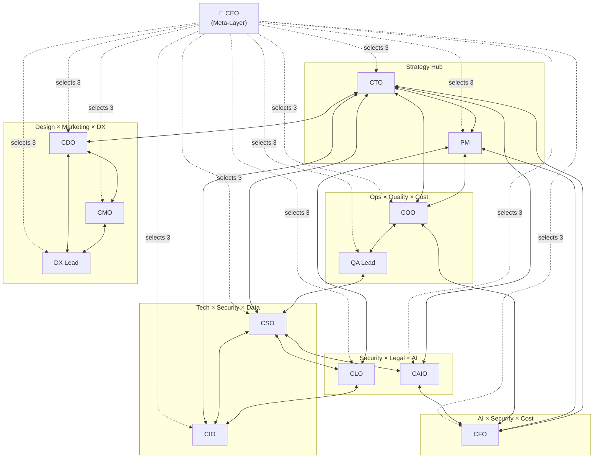

# Claude C-Suite Plugin

Executive team perspectives for any codebase. Thirteen specialized review commands that analyze your project from different leadership viewpoints.

## Commands

| Command | Role | What it reviews |
|---------|------|-----------------|
| `/ceo` | CEO (Meta) | Triages needs to the right CxOs, synthesizes cross-cutting insights |
| `/cto` | Chief Technology Officer | Tech debt, architecture, refactoring priorities, dependency risks |
| `/pm` | Product Manager | Milestone triage, issue prioritization, release planning |
| `/cdo` | Chief Design Officer | UI/UX consistency, design system health, component reuse |
| `/cso` | Chief Security Officer | Vulnerabilities, auth patterns, secret management, OWASP Top 10 |
| `/clo` | Chief Legal Officer | License compliance, data privacy, regulatory readiness, IP protection |
| `/coo` | Chief Operating Officer | CI/CD pipelines, deployment strategy, observability, incident readiness |
| `/cmo` | Chief Marketing Officer | SEO health, Core Web Vitals, social sharing, analytics implementation |
| `/caio` | Chief AI Officer | AI/ML governance, model lifecycle, responsible AI, LLM integration patterns |
| `/cfo` | Chief Financial Officer | Cloud cost optimization, resource efficiency, billing logic, compute waste |
| `/cio` | Chief Information Officer | Data governance, system integration, information architecture, schema management |
| `/qa-lead` | QA Lead | Test coverage, quality metrics, testing strategy gaps |
| `/dx-lead` | DX Lead | Developer experience, API ergonomics, SDK usability, onboarding |

## Role Details

### CEO (Meta-Layer)

- **CEO** — Sits above the cross-reference graph, not inside it. Triages the user's need to the 3 most relevant CxO perspectives, analyzes through those lenses, and synthesizes a unified executive decision. Does not perform specialized analysis — knows **which experts to consult** and how to **resolve conflicts between them**. *"The right 3 perspectives beat all 11 spread thin"*

### Strategy & Management

- **CTO** — Guards codebase health. Identifies tech debt that compounds over time, evaluates architecture decisions, and prioritizes refactoring. *"Debt compounds"*
- **PM** — Steers the ship to release. Triages milestones, orders issues by impact, and ensures bugs are fixed before features ship. *"Bugs before features"*
- **CFO** — Hunts down waste. Finds N+1 queries, idle resources, missing caches, and audits billing logic for correctness. *"Every query has a price tag"*
- **CIO** — Governs information architecture. Reviews data models, schema health, migration safety, system integration contracts, and data lifecycle. *"Schema is the contract between past and future"*

### Security & Legal

- **CSO** — Thinks like an attacker. Audits auth flows, scans for hardcoded secrets, checks dependencies against OWASP Top 10. *"Secrets are toxic"*
- **CLO** — Eliminates legal exposure. Maps dependency license trees for copyleft conflicts, assesses GDPR/CCPA readiness, and verifies IP provenance. *"Licenses are viral"*

### Product & Design

- **CDO** — Enforces design consistency. Reviews component reuse, design token adherence, and UX coherence across the app. *"Components are contracts"*
- **CMO** — Makes the product discoverable. Checks SEO fundamentals, Core Web Vitals, OGP/social sharing, and analytics instrumentation. *"Speed is conversion"*

### Operations & AI

- **COO** — Keeps production running. Audits CI/CD pipelines, deployment strategies, observability coverage, and incident readiness. *"Deploys should be boring"*
- **CAIO** — Governs AI responsibly. Reviews model lifecycle, prompt engineering quality, bias detection, eval suites, and guardrails. *"Prompts are production code"*

### Leads (report to CxOs)

- **QA Lead** — Closes testing gaps. Measures coverage, identifies missing test scenarios, and evaluates the testing strategy holistically. *"Every bug is a missing test"*
- **DX Lead** — Champions developer happiness. Reviews API ergonomics, error messages, SDK usability, and onboarding friction. *"Pit of success"*

## Installation

```bash
/plugin marketplace add JFK/claude-c-suite-plugin
/plugin install claude-c-suite
```

### Required GitHub token scopes

The plugin issues `gh` commands to read issues, milestones, and labels.
Most commands are read-only; `/pm` is the only command that may suggest
write operations (`gh issue create`, `gh issue edit`), and only after
explicit user confirmation.

| Use case | Recommended scopes |
|----------|---------------------|
| Public repos only | `public_repo` |
| Private repos | `repo` |
| Organization repos | `repo` + `read:org` |

See [SECURITY.md](./SECURITY.md) for the full threat model and the
vulnerability reporting process.

## Usage

### Review mode

Run any command to get a full review:

```
/claude-c-suite:ceo                   # Auto-diagnose and executive summary
/claude-c-suite:cto                   # Full CTO review of current repo
/claude-c-suite:cto owner/repo        # Analyze a specific repo
/claude-c-suite:cdo components        # Focus on a specific area
/claude-c-suite:cso auth              # Focus on authentication
/claude-c-suite:clo licenses          # Focus on dependency licenses
/claude-c-suite:coo cicd              # Focus on CI/CD pipeline
/claude-c-suite:cmo seo               # Focus on SEO health
/claude-c-suite:caio models            # Focus on model lifecycle
/claude-c-suite:cfo costs              # Focus on cloud costs
/claude-c-suite:cio data               # Focus on data governance
```

### Question mode

Ask any officer a direct question — they'll answer from their perspective, grounded in your actual codebase:

```
/claude-c-suite:ceo Are we ready to launch?
/claude-c-suite:cto Should we migrate to a monorepo?
/claude-c-suite:pm Should we delay the launch to fix these bugs?
/claude-c-suite:cdo Should we use a modal or a drawer here?
/claude-c-suite:cso Is our JWT implementation secure?
/claude-c-suite:qa-lead Do we need E2E tests for this flow?
/claude-c-suite:dx-lead How should we structure error responses?
/claude-c-suite:clo Can we use this GPL library in our SaaS product?
/claude-c-suite:coo Are we ready for a zero-downtime deployment?
/claude-c-suite:cmo Will this page rank well for our target keywords?
/claude-c-suite:caio Are we handling prompt injection risks?
/claude-c-suite:cfo Are we over-provisioned on our database tier?
/claude-c-suite:cio Is our data model normalized correctly?
```

## Cross-Reference Map

Each role cross-references its **Top 3 collaborators** — the 3 roles it works most closely with. The CEO sits above as a meta-layer, reading the graph to select the right perspectives for any given need.

```
┌──────────────────────────────────────────────────────────┐
│  CEO (Meta-Layer)                                        │
│  Reads the graph. Selects 3 perspectives per need.       │
│  Synthesizes cross-cutting executive decisions.           │
└────────────────────────────┬─────────────────────────────┘
                             │
─────────────────────── CxO Level ─────────────────────────

   Tech×Security×Data     Strategy Hub     AI×Security×Cost
   ┌─────┐                                  ┌──────┐
   │ CIO │◀──┐          ┌──────┐     ┌────▶│ CAIO │
   └──┬──┘   │    ┌────▶│  PM  │◀──┐ │     └──┬───┘
      │      │    │     └──────┘   │ │        │
      ▼      │    │                │ │        ▼
   ┌─────┐   │  ┌─┴────┐      ┌───┴─┴─┐  ┌──────┐
   │ CSO │◀──┼─▶│ CTO  │      │  CFO  │◀▶│ COO  │
   └──┬──┘   │  └──┬───┘      └───────┘  └──┬───┘
      │      │     │                         │
      ▼      │     ▼   Design×Marketing×DX   ▼
   ┌─────┐   │  ┌─────┐   ┌─────┐      ┌────────┐
   │ CLO │◀──┘  │ CDO │◀─▶│ CMO │      │QA Lead │
   └─────┘      └──┬──┘   └──┬──┘      └────────┘
                   │         │
                   ▼         ▼
                ┌─────────────┐
                │   DX Lead   │
                └─────────────┘

─────────────────────── Lead Level ────────────────────────
```

| Officer | Top 3 Collaborators | Cluster |
|---------|--------------------|---------| 
| CTO | PM, CSO, CIO | Strategy hub |
| PM | CTO, CFO, COO | Strategy × Operations |
| CDO | CTO, CMO, DX Lead | Design × Marketing × DX |
| CSO | CTO, CLO, CAIO | Security × Legal × AI |
| CLO | CSO, CIO, PM | Legal × Data × Strategy |
| COO | CTO, QA Lead, CFO | Ops × Quality × Cost |
| CMO | CDO, CTO, DX Lead | Marketing × Design × DX |
| CAIO | CTO, CSO, CFO | AI × Security × Cost |
| CFO | CTO, CAIO, COO | Cost × AI × Ops |
| CIO | CTO, CSO, CLO | Data × Security × Legal |
| QA Lead | CTO, COO, CSO | Quality × Ops × Security |
| DX Lead | CTO, CDO, CMO | DX × Design × Marketing |

All officers also cross-reference [PhD Panel](https://github.com/JFK/claude-phd-panel-plugin) findings when available.



## Design Principles

- **Analysis only** — Commands recommend actions but never execute changes
- **Cross-referencing** — Run multiple commands in one session; they reference each other's findings
- **GitHub-native** — Uses `gh` CLI to gather issues, milestones, and commit history
- **Universal** — No project-specific assumptions; works with any codebase

## License

MIT
